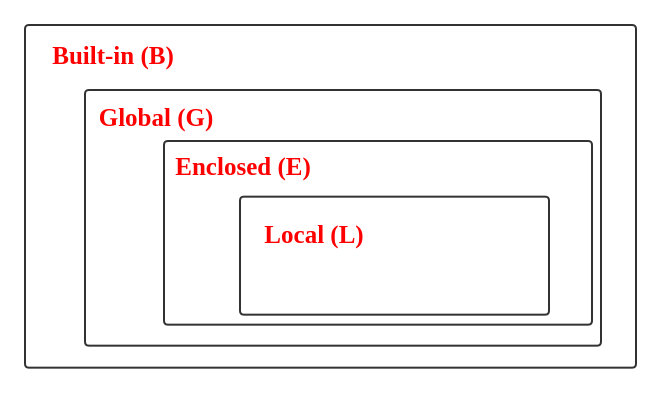

# Python scopes

There are 4 types of scope in Python: LEGB

- Local Scope
- Enclosed Scope
- Global Scope
- Built-in Scope

The first occurrence of a variable found in any of the scopes starting sequentially from

__Local__ -> __Enclosed__ -> __Global__ -> __BuiltIn__ 

will be returned.

